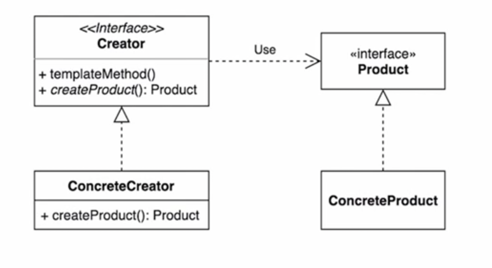
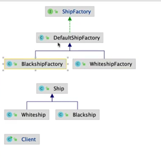
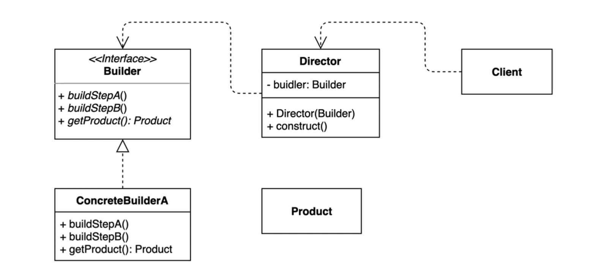
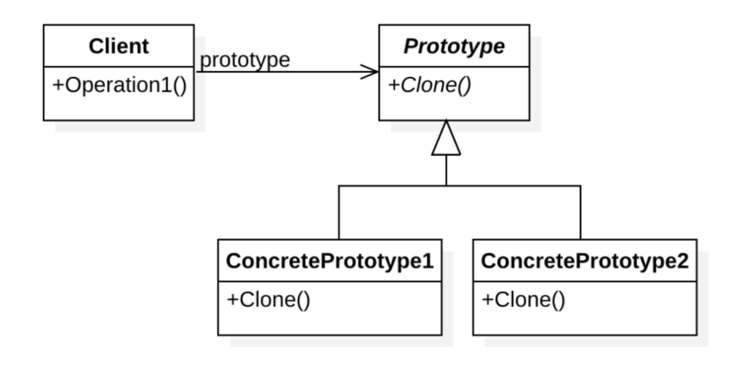
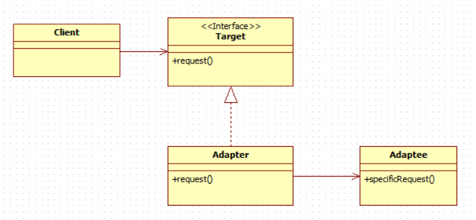

# Design Pattern

# 생성 패턴
## SingleTone
   1. Spring 에서 사용하는 싱글톤
      1. Runtime

## 팩토리 매소드 패턴
강한결합 과 느슨한 결합
- 뉴 쓰지않고 특정 메소드를 구현해서 쓰는걸 팩토리 메서드 라고 한다.
- 소스가 바뀌는 과정이랑 이게 뭐가 좋은지를 해야 한다.
  solid - 패턴 중요하다.

### 구체적으로 어떤 인스턴스를 만들지는 서브 클래스가 정한다.
- 왜 필요 한가 ?
   - 화이트쉽 만들다 -> 블랙쉽 -> 불루쉽 -> 수률양용 배 요걸 다만들라면 힘들겠지
   - OCP -> 확장에는 열려 있어야 하고 변경에는 닫혀 있어야 한다. 이를 잘 지킬 수 있다. 
     
- 중간에 추상 클레스를 둘수 있다. 자바 8 의 경우 인터페이스에서 private method 선언이 안되니까

- 단점 - 클래스가 늘어나는 단점이 있다.
- 변경에 닫혀있다. - 기존 코드를 변경하지 않는것 
- Spring - Calander, NumberFormat, BeanFactory

## 추상 팩토리 패턴
1. 클라이언트에서 구체적인 코드를 사용하는 걸 개선 하기 위함 !
2. 단일 책임 원칙을 잘 지켰다 !
3. 여렇 관련 객체들을 구체적인 클래스에 의존하지 않게 하기 위함 ?

## 빌더 패턴 

- Creationl pattern 중 하나 
- SRP 원칙을 보증해주고, 코드 재사용성을 높혀준다.

1. 정의 목적 
   1. 다양한 객체 생성 문제에 대한 유현한 솔루션을 제공하기 위해 설계된 패턴 
   2. 객체의 생성과 표현 코드를 분리 (The intent of the Builder design pattern is to separate the construction of a complex object from its representation)
   

    
    - 설명 
      - Builder 에서 product를 조립 하기 위한 메서드를 정의한다.  
      - ConcreteBuilderA에서 이를 구현한다. 
      - Director 는 Builder 를 주입받아서 Product를 생성한다.
      - 클라이언트 코드에서는 Director 혹은 Builder 를 사용 

2. 장점
   1. 객체를 만드는데 복잡한 순서가 있다면 빌더 패턴을 통해 순서를 강제 하여 클라이언트 코드에서 쉽게 인스턴스를 만들수 있다.
   2. 객체를 생성하는데 다른 표현 코드를 사용할 수 있다.
   3. 불완적인 객체를 사용하지 못하게 할 수 있다. 
   4. Director 를 통해 복잡한 객체를 만드는 과정을 어느정도 숨길 수 있다.
   5. Builder 를 통해서 동일한 프로세서를 거치지만 다른 인스턴스를 만들 수 있다. 
   6. 많은 Constructor, 너무 많은 파라미터를 가지는 Constructor 를 없앨 수 있다. 
   7. 코드 재 사용성을 개선 할 수 있고 SOLD와 DRY 원칙을 준수 할 수 있다. 
3. 단점 
   1. Director Builder 를 만들어야 한다. -> 객체 생성을 추가로 해야한다. -> 생성시간 과 리소스를 많이 먹을 수 있다.
   2. 생성 구조가 복잡해진다.
   3. 100개의 DTO, Entity가 있다면 100개의 Concrete Builder 가 있어야 한다. 
   4. 잘못 구현하면 Feature Envy, God Class 코드 스멜 문제 발생 가능성
      1. Feature Envy: 한 Class 에 구현된 메서드가 다른 클레스에 구현된 메서드를 더 많이 쓰는것 
      2. God Class: 너무 많은 타입, 카테고리화 되지 않은 메서드 들이 한 클래스에 존재하는 경우 
   5. test stub 을 얻을때 copy & Past programing 권장하게 한다. 
   6. Concurrent implementation with Abstract Factory design pattern with the particularity that it creates different types of objects, not objects of the same family type. This may lead to confusion and the incorrect use of any of the two patterns.
   
4. Lombok
   1. @Builder
   2. @SuperBuilder

## Prototype 패턴

- proto - 처음으로 만들어진 
- 기존 인스턴스를 응용해서 새로운 인스턴스를 만드는 경우, 생성이 오래걸리는 인스턴스를 복사해서 필요한 타입만 변패턴 
- 인터페이스의 클론을 쓴다. 
- Clonable - 마커 인터페이스 패턴 얘가 무슨일을 하는지 간파하기 위한 패턴 나는 클로너블이 가능 하다
- native method ?? 
- deep copy
- 걍 copy 는 shallow copy 이다. shllow copy는 객체를 참조한다. 객체를 참조한다는 말은 기존 객체가 변경되면 카피한 객체도 변경된다는 의미 이다. 
- deep copy 는 객체를 복사한다. 
- modelMapper - DTO 만들때 좋을것 같다. 

# 구조 패턴 
## Adaptor 패턴

- 클라이언트와 어댑티 사이에 있는 무언가를 만든다. 
- 기존 코드를 그대로 유지하면서 우리가 원하는 타겟 인터페이스에 맞춘 구현체를 만들어서 사용할 수 있다.
- ocp 를 잘 따랐다. 
- 책임을 적절하게 구분할수 있다. srp 를 잘 준수 했다. 
- 단점의 경우 새클래스가 생겨 복잡도가 증가할 수 있다. adaptor 라는 클래스가 생김으로 ! 
- 이게 싫다면 adaptee 에서 target 을 직접 구현하면 복잡도를 조금 낮출 수 있다. 
- 인풋 타입과 아웃풋 타입이 전혀 다른경우 어뎁터가 적용되어 있다고 볼 수 있다. 

