# Design Pattern
- 비슷한 패턴 간의 차이점은 무엇인가 ? 
- 계속해서 봐야 좋다 !
- uml 
  - 실선으로 연결된 부분은 : 구조족으로 연결된
  - 점선은 : 디펜던시 
# 생성 패턴
## SingleTone
   1. Spring 에서 사용하는 싱글톤
      1. Runtime

## 팩토리 매소드 패턴
강한결합 과 느슨한 결합
- 뉴 쓰지않고 특정 메소드를 구현해서 쓰는걸 팩토리 메서드 라고 한다.
- 소스가 바뀌는 과정이랑 이게 뭐가 좋은지를 해야 한다.
  solid - 패턴 중요하다.

### 구체적으로 어떤 인스턴스를 만들지는 서브 클래스가 정한다.
- 왜 필요 한가 ?
   - 화이트쉽 만들다 -> 블랙쉽 -> 불루쉽 -> 수률양용 배 요걸 다만들라면 힘들겠지
   - OCP -> 확장에는 열려 있어야 하고 변경에는 닫혀 있어야 한다. 이를 잘 지킬 수 있다. 
     
- 중간에 추상 클레스를 둘수 있다. 자바 8 의 경우 인터페이스에서 private method 선언이 안되니까

- 단점 - 클래스가 늘어나는 단점이 있다.
- 변경에 닫혀있다. - 기존 코드를 변경하지 않는것 
- Spring - Calander, NumberFormat, BeanFactory

## 추상 팩토리 패턴
1. 클라이언트에서 구체적인 코드를 사용하는 걸 개선 하기 위함 !
2. 단일 책임 원칙을 잘 지켰다 !
3. 여렇 관련 객체들을 구체적인 클래스에 의존하지 않게 하기 위함 ?

## 빌더 패턴 

- Creationl pattern 중 하나 
- SRP 원칙을 보증해주고, 코드 재사용성을 높혀준다.

1. 정의 목적 
   1. 다양한 객체 생성 문제에 대한 유현한 솔루션을 제공하기 위해 설계된 패턴 
   2. 객체의 생성과 표현 코드를 분리 (The intent of the Builder design pattern is to separate the construction of a complex object from its representation)
   

    
    - 설명 
      - Builder 에서 product를 조립 하기 위한 메서드를 정의한다.  
      - ConcreteBuilderA에서 이를 구현한다. 
      - Director 는 Builder 를 주입받아서 Product를 생성한다.
      - 클라이언트 코드에서는 Director 혹은 Builder 를 사용 

2. 장점
   1. 객체를 만드는데 복잡한 순서가 있다면 빌더 패턴을 통해 순서를 강제 하여 클라이언트 코드에서 쉽게 인스턴스를 만들수 있다.
   2. 객체를 생성하는데 다른 표현 코드를 사용할 수 있다.
   3. 불완적인 객체를 사용하지 못하게 할 수 있다. 
   4. Director 를 통해 복잡한 객체를 만드는 과정을 어느정도 숨길 수 있다.
   5. Builder 를 통해서 동일한 프로세서를 거치지만 다른 인스턴스를 만들 수 있다. 
   6. 많은 Constructor, 너무 많은 파라미터를 가지는 Constructor 를 없앨 수 있다. 
   7. 코드 재 사용성을 개선 할 수 있고 SOLD와 DRY 원칙을 준수 할 수 있다. 
3. 단점 
   1. Director Builder 를 만들어야 한다. -> 객체 생성을 추가로 해야한다. -> 생성시간 과 리소스를 많이 먹을 수 있다.
   2. 생성 구조가 복잡해진다.
   3. 100개의 DTO, Entity가 있다면 100개의 Concrete Builder 가 있어야 한다. 
   4. 잘못 구현하면 Feature Envy, God Class 코드 스멜 문제 발생 가능성
      1. Feature Envy: 한 Class 에 구현된 메서드가 다른 클레스에 구현된 메서드를 더 많이 쓰는것 
      2. God Class: 너무 많은 타입, 카테고리화 되지 않은 메서드 들이 한 클래스에 존재하는 경우 
   5. test stub 을 얻을때 copy & Past programing 권장하게 한다. 
   6. Concurrent implementation with Abstract Factory design pattern with the particularity that it creates different types of objects, not objects of the same family type. This may lead to confusion and the incorrect use of any of the two patterns.
   
4. Lombok
   1. @Builder
   2. @SuperBuilder

## Prototype 패턴

- proto - 처음으로 만들어진 
- 기존 인스턴스를 응용해서 새로운 인스턴스를 만드는 경우, 생성이 오래걸리는 인스턴스를 복사해서 필요한 타입만 변패턴 
- 인터페이스의 클론을 쓴다. 
- Clonable - 마커 인터페이스 패턴 얘가 무슨일을 하는지 간파하기 위한 패턴 나는 클로너블이 가능 하다
- native method ?? 
- deep copy
- 걍 copy 는 shallow copy 이다. shllow copy는 객체를 참조한다. 객체를 참조한다는 말은 기존 객체가 변경되면 카피한 객체도 변경된다는 의미 이다. 
- deep copy 는 객체를 복사한다. 
- modelMapper - DTO 만들때 좋을것 같다. 

# 구조 패턴 
- 클래스나 객체를 조합해 다른 구조를 만드는 패턴 
- 객체들을 서로 묶어서 제공하는 패턴 
## Adaptor 패턴

- 클라이언트와 어댑티 사이에 있는 무언가를 만든다. 
- 기존 코드를 그대로 유지하면서 우리가 원하는 타겟 인터페이스에 맞춘 구현체를 만들어서 사용할 수 있다.
- ocp 를 잘 따랐다. 
- 책임을 적절하게 구분할수 있다. srp 를 잘 준수 했다. 
- 단점의 경우 새클래스가 생겨 복잡도가 증가할 수 있다. adaptor 라는 클래스가 생김으로 ! 
- 이게 싫다면 adaptee 에서 target 을 직접 구현하면 복잡도를 조금 낮출 수 있다. 
- 인풋 타입과 아웃풋 타입이 전혀 다른경우 어뎁터가 적용되어 있다고 볼 수 있다.

## 브릿지패턴
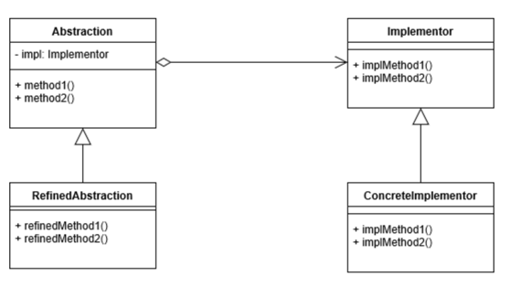
- 추상적인 것과 구체적인 것을 분리하여 연결 
- 트리 
- 동작 - 상태 와같이 성격이 상이한것을 분리하고 연결하는것 
- Abstraction 고차원적인 상위의 로직을 가지고 있음 
  - Redefined Abstraction 상위 로직을 좀 구체적으로 
- Implemantation - 자세한 구현을 가지고 있음 
- OCP 
- 추상적인 코드와 구체적인 코드를 분리할 수 있다. !

## Composite 디자인 패턴 
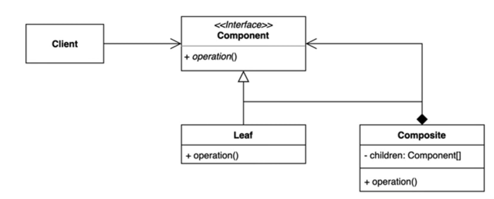
- 전체 계층구조와 전체의 부분 계층을 클라이언트 입장에서 동일하게 사용할 수 있는 패턴
- 아이템 과 가방 예를 들어 아이템의 가격 가방안에 있는 모든 아이템의 가격을 뭔가 동일한 인터페이스로 얻어 오는것
- 좀 뭔가 flatmap 같은 느낌 
- 트리구조를 구성 해야 해당 패턴을 사용가능

- UML 설명 
  - 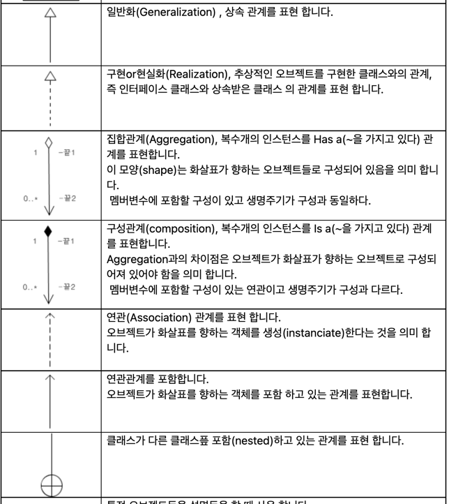
  - 참조 (https://m.blog.naver.com/PostView.naver?isHttpsRedirect=true&blogId=kyung778&logNo=60154874584)
  - Client 와 Component : 연관관계 - client 가 Component를 포함하고 있다. 
  - Component 와 Composite : 구성관계 - Composite은 Component로 구성되어 있다.
    - 구성관계 (Composition)- part-of 관계 다이아 쪽이 화살표쪽 으로 구성되어 있다, 다이아 쪽이 화살표 쪽의 라이프 사이클을 통제한다., 자동차 ♦︎--> 엔진, 자동차가 부셔지면 엔진도 부셔진다. 
    - 집합관계 (Aggregation) - has-a 관계  다이아 쪽이 화살표쪽을 가지고 있다. 다이아 쪽과 화살표쪽의 라이프 사이클 관계 없다., 사람 <>--> 주소, 사람이 없어진다고 주소가 사라지지는 않는다.
    - 참조 (https://sonsooresoon.tistory.com/entry/Aggregation-%EA%B3%BC-Composition-%EC%9D%98-%EC%B0%A8%EC%9D%B4)
  - Component 와 Composite, Leaf : 일반화(Generalization) 관계 상속관계 

- 장점 
  - 복잡한 트리구조를 간단하게 쓸 수 있다. 
  - 클라이언트 코드에서 클레스 구조에 대해 많은 걸 알지 않아도 된다. 
  - 클라이언트 코드 변경을 최소화 할 수 있다. ocp 확장에는 열려 있고 변경에는 닫혀 있다. 
- 단점 
  - 트리구조를 만들어야 하기 때문에 지나치게 일반화를 해야 하는 경우도 생길 수 있다. 
    - (억지로 맞출려다 보면 런타임에 printPrice 에서 Componet의 Type을 체크해야 할 수 있다. 이럴경우엔 Composite 패턴 사용이 맞는지 생각해 보자 )
- Override 메서드는 컴파일타임에 이 메서드가 인터페이스의 메서드 인지 확인을 해준다. 

## Decorator Pattern 
- Dynamic run time 에 뭔가를 변경할 수 있다.  
- Runtime에 기존 코드를 확장할 수 있다. 
- 매우 유용한 패턴
- 상속을 쓰면 매우 유연해 지지 않아질 수 있다. 
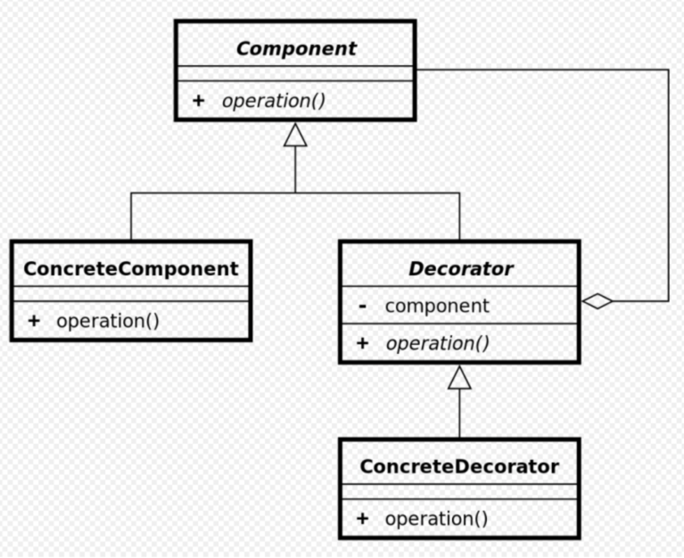

- Wrapper 패턴 딱 하나만 감싼다. 

## facade 패턴 
- 복잡한 코드를 숨기는 패턴 
- 비지니스 로직에만 집중하도록 하게 할 수있다. 
- 루즐리 커플드... 의존성을 최대한 하지 않도록 ? 

## Flyweight pattern 
- 메모리가 가벼운 패턴을 만드는게 목표 
- 자주 변하는 것(외적인것, 본질적이지 않은것)과 변하지 않는것(본질적인 것, 내적인것)을 분리
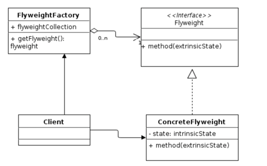
- Flyweight 잘 변하지 않는것을 모아논것 
- 장점 메모리 감소 가능 캐릭터가 중복되는 데이터를 가지고 있지 않음으로

## Proxy 

## 책임연쇄패턴
1. 책임은 SRP 할때 
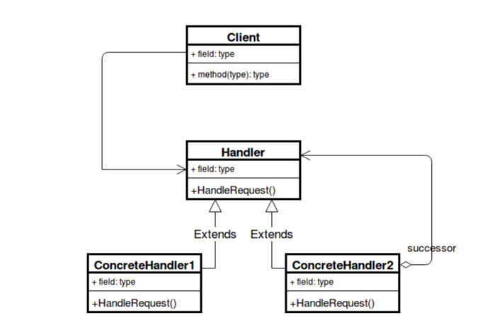
2. Client 는 리퀘스트 핸들러에 요청을 처리하라고 주고 그러면 체인을 흘러 가면서 처리가되는 좀 필터 비슷 한 패턴 
3. 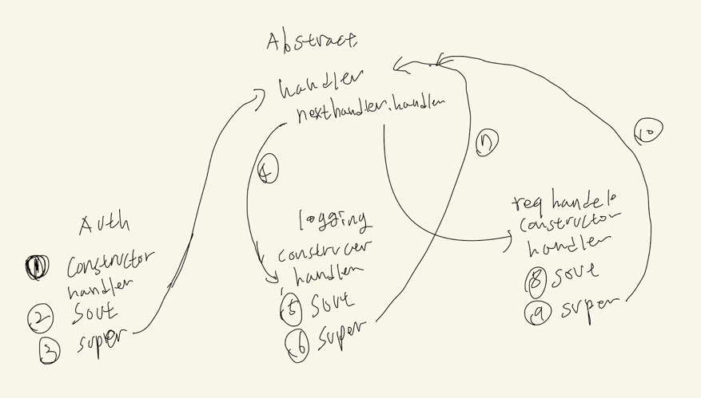
4. SRP, OCP 준수 
5. 

## Command 패턴 
1. 발신자 - 커맨드 - 수신자 이렇게 디커플링 시킴 

## 이터레이터 패턴 
1. 행동 디자인 패턴 
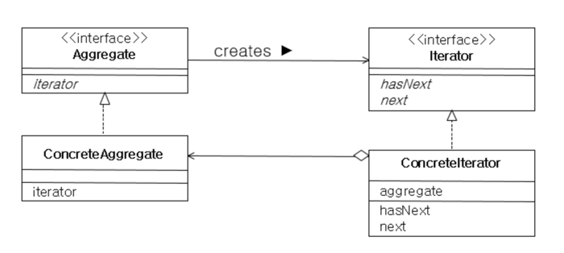
2. 애그리게이트는 있을수 있고 없을 수 있다. 보드가 컨크리트 애그리게이트
3. 리스트는 애그리게이트 이터레이터 
4. arrayList 는 컨크리트 애그리게이트

## mediator pattern (중재자 패턴)
1. 개요
   1. 여러 객체들간의 의사소통 방법을 추상화 시켜서 그 객체들간의 의존성을 낮추는 방법 
   2. 컴포넌트들이 거미줄 처럼 의존하고 있는 상황을 해결하기 위한 패턴 이다. 
   3. 실생활의 예 
      1. 관리실과 주민 
      2. 비행기와 관제 탑
2. UML
   1. 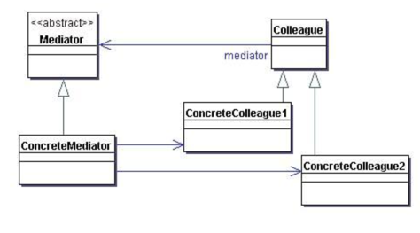
      1. 모양 보다는 Colleague 가 다른 Colleague 를 참조하지 않는다는 것이 중요
         1. 실제 구현은 ConcreteMediator 만 사용할 수도 있다.
         2. Colleague 도 공통의 인터페이스를 구현하는 그림이 아닌 ConcreteColleague 만 써서 구현 할 수 있다. 
      2. mediator 요청을 받아드리고 처리하는 중재자 
      
3. 기존 코드 UML
   1. 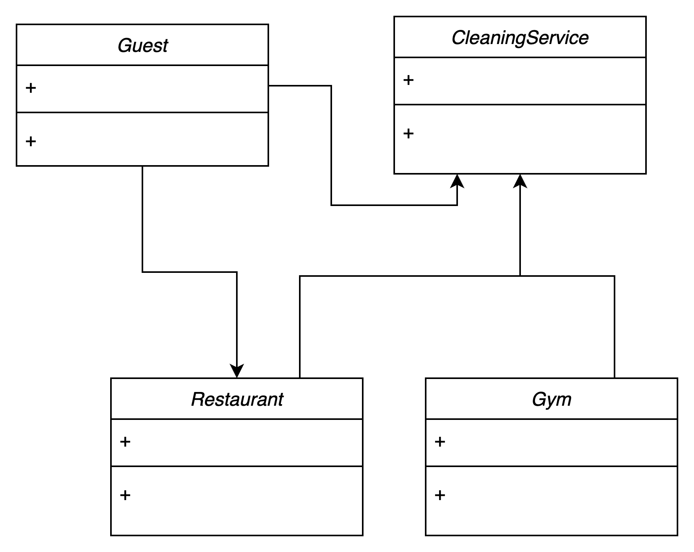
      1. 의존관계가 너무 복잡하다. 
      2. Guest, Restaurant, CleaningService 는 추이 종속성 관계로 '자신이 직접 사용하지 않는 요소에는 절대로 의존해서는 안된다' 는 소프트웨어 원칙을 위반하게 된다.
   
4. 변경 코드 UML
   1. 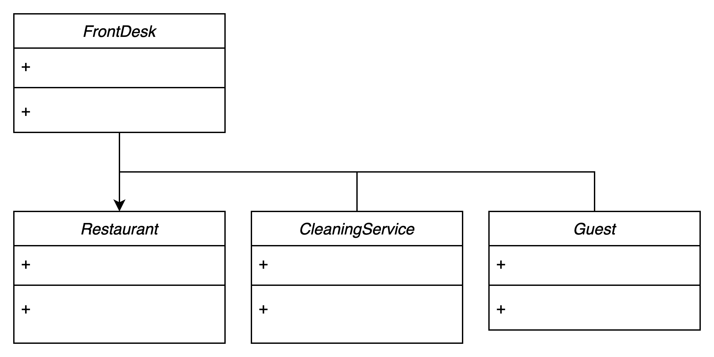
      1. FrontDesk - CleaningService, Guest 양방향 관계
      2. FrontDesk -> Restaurant
5. 장점
   1. 컴포넌트 코드를 변경하지 않고 새로운 중재자를 만들어 사용할 수 있다. 
      1. 그러나 지금 작성된 코드로는 해당 장점을 누릴 수 없다. 새로운 클래스를 생성하게 되면 Colleague 에서 쓰는 메서드가 변경 될 수 있음으로 (인터페이스 권장)
   2. 각각의 컴포넌트 코드를 보다 간결하게 유지할 수 있다. 
6. 단점
   1. 중재자 역할을 하는 클래스의 복잡도와 결합도가 증가한다.
      1. 테스트가 어려워 지고, 코드 변경이 어려워진다. 
7. Spring 
   1. DispatcherServlet - mediator
      1. DispatcherServlet 의 경우엔 각 컴포넌트들 간의 관계가 단방향이다.  
      2. DispatcherServlet 에서 각 컴포넌트들을 처리하여 결과 값을 돌려준다. 
   2. 